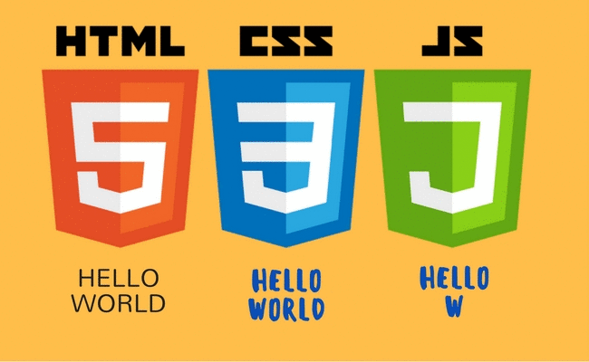

# Aprendizado de Javascript na DIO
Repositório para salvar códigos de Javascript aprendidos na Plataforma DIO. 

## Conteúdos do repositório:

1. Lógica de Programação
2. Introdução ao HTML e CSS3
3. Introdução ao JavaScript
4. Sintaxe Básica em JavaScript
5. Sintaxe e Operadores (Utilizando JS)
6. Variáveis e Tipos (JS)
7. Funções
8. Javascript Assíncrono
9. Orientação a Objetos
10. Map, Filter e Reduce

## Ferramentas Utilizadas

- HTML5
- CSS3
- Javascript
